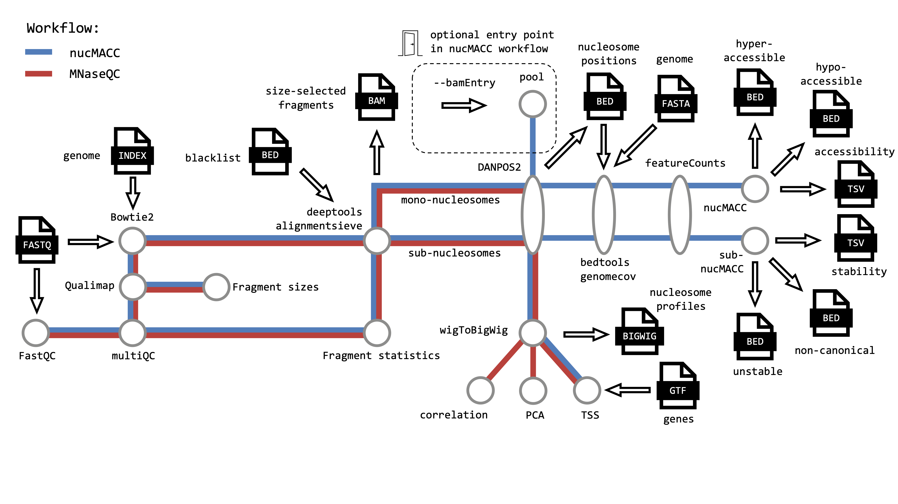

# nucMACC

**Original paper** - https://doi.org/10.1101/2022.12.29.521985

## Introduction
nucMACC is an automated analysis pipeline for the analysis of nucleosome positions, accessibility and stability. The pipeline contains two main workflows:

1. `MNaseQC` for QC and  exploratory analysis
2. `nucMACC` for analysis of nucleosome positions, accessibility and stability

<p align="center">
	
</p>

Given trimmed paired-end sequencing reads in fastq format, this pipeline will run:

* `MNaseQC` and `nucMACC`
    1. QC using `FastQC` on fastq files
    2. Alignment using `Bowtie2` on fastq files
    3. QC using `Qualimap` on aligned fragments
    4. Fragment size distribution plot
    5. Group the fragments by size using 'deepTools alignmentSieve' and optionally filter blacklisted regions
        1. Mono-nucleosome (140 - 200 bp)
        2. Sub-nucleosome (< 140 bp)
    6. Report fragment statistics of each processing step
    7. Create nucleosome maps of Mono- and Sub-nucleosomes using `DANPOS`
    8. Optionally create TSS profiles using `deepTools computeMatrix`
    9. Summary reports using `MultiQC`


* `MNaseQC` specific
    1. PCA of nucleosome maps using `deepTools`
    2. Correlation analysis using `deepTools`

* `nucMACC` specific
    1. Pool all mono-nucleosome samples
    2. Obtain mono-nucleosome positions from pooled samples and sub-nucleosome positions from lowest MNase concentration using `DANPOS`
    3. Get GC content of nucleosome positions using `bedtools genomecov`
    4. Count number of fragments using `featureCounts`
    5. Remove nucleosome positions with low fragment count (mono-nucleosmes < 30 and sub-nucleosomes < 5)
    6. Calculate (sub-)nucMACC score using linear regression analysis
    7. Correct for MNase GC-bias using LOWESS
    8. Identify hyper-/hypo-accessible nucleosomes or unstable and non-canoncical nucleosomes.

`nucMACC` is meant to run on pooled replicates in fastq format, whereas `MNaseQC` uses single replicates. As the `MNaseQC` and the `nucMACC` workflow have several steps in common, it is recommended to run first `MNaseQC` and report the fragment size selected bam files using `--publishBamFlt`. Then setting `--bamEntry` option, a shorter version of the `nucMACC` workflow can be run using the generated bam files as input. Here in an additional step at the beginning replicates are pooled.

## Get started

### Requirements

* `Docker` and `nextflow` are required to run the nucMACC pipeline. Additional software used in the pipeline is packaged in Docker container and will be automatically downloaded during the first execution of the pipeline.
* The pipeline is compatible with all computational infrastructures. Executing the pipeline on cloud or HPC systems may require to adapt the [`nextflow.config`](https://www.nextflow.io/docs/latest/basic.html).
* For large reference genomes the pipeline requires at least 32 GB memory and default settings allocate 45 GB memory to demanding processes. Memory usage can be adjusted using the option `--high_memory` or directly in the [`nextflow.config`](https://www.nextflow.io/docs/latest/basic.html).
* The pipeline requires paired-end sequencing data
* Bowtie2 index of reference genome, reference genome in fasta format and the length of the mappable genome.
* For details about the GTF file format required for TSS plots, see the documentation of [`deeptools computeMatrix`](https://deeptools.readthedocs.io/en/develop/content/tools/computeMatrix.html). For further customisation of TSS plots we recommend direct use of the deepTools package and the bigwig files provided by the pipeline.   

### Installation
You can obtain the pipeline directly from GitHub:
```bash
git clone https://github.com/uschwartz/nucMACC.git
```

### Test pipeline
The pipeline comes with a ready-to-use test data set.
```bash
nextflow run path2nucMACC/nucMACC --test
```

### Usage
We recommend to use first the `MNaseQC` workflow and specifying `--publishBamFlt`. Then take the output and run `nucMACC` with `--bamEntry` option.  

To execute the pipeline a samplesheet is required. The content depends on the workflow to execute. See examples in the `toyData` folder.

Workflow:

* `MNaseQC` (example `toyData/input_replicates.csv`)

```csv
Sample_Name,path_fwdReads,path_revReads,MNase_U
H4_rep1_6.25U_cut,/toyData/H4_rep1_6.25U/H4_rep1_6.25U_cut_1.fastq.gz,/toyData/H4_rep1_6.25U/H4_rep1_6.25U_cut_2.fastq.gz,6.25
H4_rep2_6.25U_cut,/toyData/H4_rep2_6.25U/H4_rep2_6.25U_cut_1.fastq.gz,/toyData/H4_rep2_6.25U/H4_rep2_6.25U_cut_2.fastq.gz,6.25
H4_rep1_100U_cut,/toyData/H4_rep1_100U/H4_rep1_100U_cut_1.fastq.gz,/toyData/H4_rep1_100U/H4_rep1_100U_cut_2.fastq.gz,100
H4_rep2_100U_cut,/toyData/H4_rep2_100U/H4_rep2_100U_cut_1.fastq.gz,/toyData/H4_rep2_100U/H4_rep2_100U_cut_2.fastq.gz,100
```
Each row represents a pair of fastq files. Here unique sample names are required.


* `nucMACC --bamEntry` (example `toyData/sub_input.csv`)

```csv
Sample_Name,replicate,path_mono,path_sub,MNase_U
H4_6.25U,rep1,/toyData/monoNuc/H4_rep1_6.25U_cut_mono.bam,/toyData/subNuc/H4_rep1_6.25U_cut_sub.bam,6.25
H4_6.25U,rep2,/toyData/monoNuc/H4_rep2_6.25U_cut_mono.bam,/toyData/subNuc/H4_rep2_6.25U_cut_sub.bam,6.25
H4_100U,rep1,/toyData/monoNuc/H4_rep1_100U_cut_mono.bam,/toyData/subNuc/H4_rep1_100U_cut_sub.bam,100
H4_100U,rep2,/toyData/monoNuc/H4_rep2_100U_cut_mono.bam,/toyData/subNuc/H4_rep2_100U_cut_sub.bam,100
```
Each row represents a pair of fastq files. Rows with the same sample name are considered technical replicates and pooled automatically. Only numerical values are allowed in the last column `MNase_U`. Duration of MNase experiment could be used as well, if the MNase concentration was constant in the experiments, but the time of digestion differed. It is recommended to use the output of `MNaseQC` workflow, which can be obtained specifying `--publishBamFlt`. However, it is as well possible to enter the pipeline at this point with manually processed bam files.


* nucMACC (example `toyData/input.csv`)

```csv
Sample_Name,path_fwdReads,path_revReads,MNase_U
H4_rep1_6.25U_cut,/toyData/H4_rep1_6.25U/H4_rep1_6.25U_cut_1.fastq.gz,/toyData/H4_rep1_6.25U/H4_rep1_6.25U_cut_2.fastq.gz,6.25
H4_rep1_100U_cut,/toyData/H4_rep1_100U/H4_rep1_100U_cut_1.fastq.gz,/toyData/H4_rep1_100U/H4_rep1_100U_cut_2.fastq.gz,100
```
Each row represents a pair of fastq files. In case of several replicates per MNase titration point, the fastq files need to be pooled before starting the pipeline. Only numerical values are allowed in the last column `MNase_U`. Duration of MNase experiment could be used as well, if the MNase concentration was constant in the experiments, but the time of digestion differed.  

**Execute:**

* `MNaseQC`
```bash
nextflow run path2nucMACC/nucMACC \
        --analysis 'MNaseQC' \
        --csvInput 'sample_sheet.csv' \
        --outDir <OUTDIR> \
        --genomeIdx 'Bowtie2Index/genome' \
        --genomeSize 119481543 \
        --genome 'genome.fa' \
        --publishBamFlt \
        --blacklist 'blacklisted_regions.bed'  \
        --TSS 'genes.gtf'
```
All options, except `--publishBamFlt`,`--blacklist`, and `--TSS`, are required.   


* `nucMACC` with `--bamEntry`
```bash
nextflow run path2nucMACC/nucMACC \
        --analysis 'nucMACC' \
        --csvInput 'sample_sheet.csv' \
        --outDir <OUTDIR> \
        --genomeIdx 'Bowtie2Index/genome' \
        --genomeSize 119481543 \
        --genome 'genome.fa' \
        --bamEntry \
        --TSS 'genes.gtf'
```
All options, except `--TSS`, are required.   


## Get help

```bash
nextflow run path2nucMACC/nucMACC --help
```


## Contact

Please log all issues/suggestions on the nucMACC GitHub page: https://github.com/uschwartz/nucMACC/issues

Uwe Schwartz: uwe.schwartz@ur.de

## Cite

Wernig-Zorc et al., 2023, nucMACC: An optimized MNase-seq pipeline measures genome-wide nucleosome accessibility and stability. bioRxiv (https://doi.org/10.1101/2022.12.29.521985)
